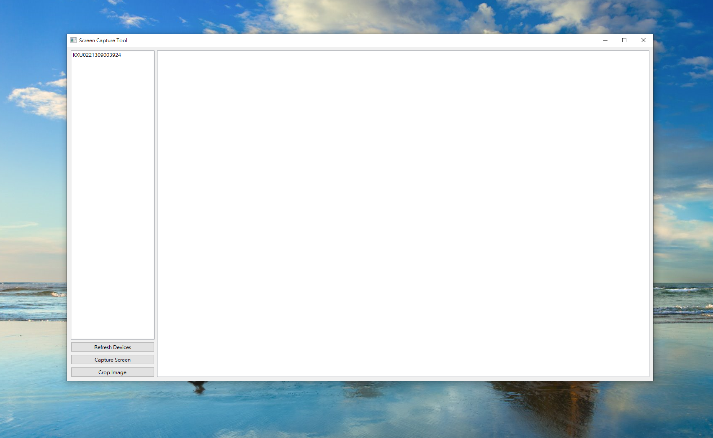

# Metisse

Metisse is a powerful image recognition and automation package designed to facilitate the development of scripts for mobile devices. It provides an extensive set of tools for image recognition, screenshot manipulation, and user interaction, such as tapping, swiping, and pressing.

## Features


- Image recognition using template matching
- Screenshot manipulation, including cropping and saving
- Automation of user interactions, such as tapping, swiping, and pressing
- Customizable parameters for image recognition and automation tasks
- Easy integration with existing automation frameworks

## Installation

To install Metisse, run the following command in your terminal:

```bash
pip install metisse
```

### Additional Requirements

#### Android Devices

1. Enable Developer Mode on your Android device.
2. Turn on USB Debugging (adb) on your Android device.
3. Install Android Debug Bridge (adb) on your computer.
4. Add adb to your system path.

#### iOS Devices

1. Install Appium/WebDriverAgent on your ios device.

### Enabling Developer Mode and USB Debugging (adb) on Android Devices

Follow these steps to enable Developer Mode and USB Debugging on your Android device:

1. Open the Settings app on your Android device.
2. Scroll down and tap "About phone" or "About device."
3. Find the "Build number" or "Software version" and tap it 7 times. You will see a message that you are now a developer.
4. Go back to the main Settings menu and tap "Developer options" (it should be visible now).
5. Enable "USB Debugging."

### Android Debug Bridge (adb) Installation and Configuration

Follow these steps to install and configure adb:

1. Download the Android SDK Platform Tools from the following link: https://developer.android.com/studio/releases/platform-tools
2. Extract the downloaded zip file to a location of your choice.
3. Add the extracted folder to your system's PATH variable.

### Usage
Here's a simple example demonstrating how to use Metisse for image recognition and user interaction:

python
Copy code
```bash
from metisse.metisse import MetisseClass
from metisse.params import ImageRecognitionParams, SaveParams

class script_example(MetisseClass):
    def __init__(self, device_id="", relatively_path="", pyqt6_ui_label={}, os_environment=""):
        MetisseClass.__init__(
            self,
            device_id=device_id,
            relatively_path=relatively_path,
            pyqt6_ui_label=pyqt6_ui_label,
            os_environment=os_environment,
        )

    def __call__(self, *args, **kwargs):
        # Your custom script implementation goes here

if __name__ == "__main__":
    script_obj = script_example("01234567(test_uid)", None, None, "android")
    script_obj()
```

Here's a function designed to generate a sample project. After running the code, it will create a sample project in the current directory, including a simple script, a device name folder automatically generated after simulating a connection to a device, an icon folder (containing test examples), and a default script GUI (which requires connection to a device to use).
```bash
from metisse.metisse import MetisseClass
import metisse.example.generate_example as ex
if __name__ == '__main__':

    ex.create_example_py_file()
```
This is a script structure diagram.
```bash
your project
│   script_example.py
│
├───ui
├───icon
│   └───script_example
└───01234567(test_uid)
    ├───backup
    ├───log
    ├───storage
    │   └───script_example
    └───temp_image
```
For more detailed information about the available methods and their usage, please refer to the MetisseClass Methods documentation.
You can also use this tool for rapid development of automation scripts: [AndroidScreenCaptureTool](https://github.com/weekanda7/AndroidScreenCaptureTool).



## Contributing
We welcome contributions to Metisse! If you'd like to contribute, please follow these steps:
- Fork the repository
- Create a new branch for your changes
- Make your changes and test them thoroughly
- Commit your changes and push them to your forked repository
- Create a pull request with a detailed description of your changes
- Please make sure to follow the code style and conventions used in the project.

## License
Metisse is licensed under the Apache License 2.0.